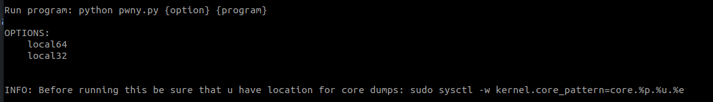
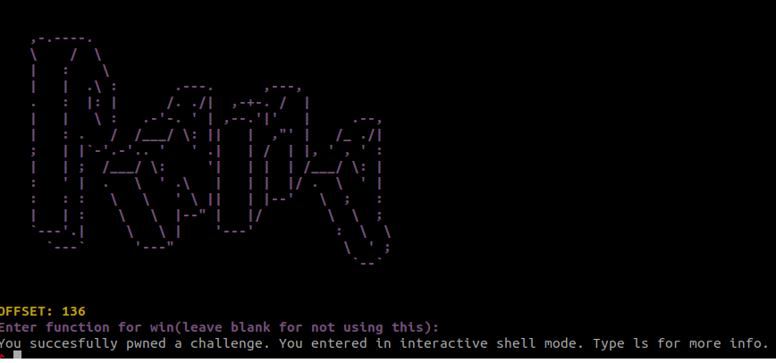

# AutoPwn-Solver
Basic auto solver for Binary Exploitation local challenges. Currently is only working locally with several basic bufferoverflow vulnerabilities. Remote part will be added as soon as I have time to upgrade it.

# Usage

`python3 pwny.py local64 filename` for 64bit architecture

or

`python3 pwny.py local32 filename` for 32bit architecture

I also uploaded binary file for testing.

This is how should it look.

